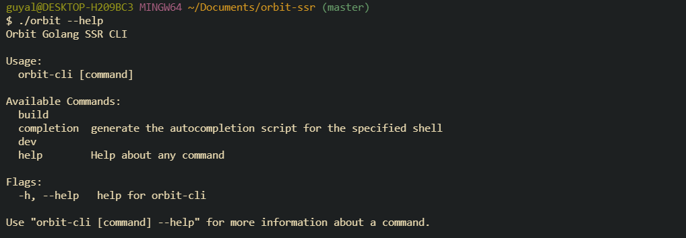

# Orbit SSR
Golang SSR framework featuring native react support with zero boilerplate.

## Installation
- manual installation

### Manual
To install manually, please download the correct distributable target for your machine. Next, you can either put it directly
in the directory you wish to use it in (and call it directly) or put it into your bash profile.

## Contributing
### Running the project
To run the project, please first download the required tools.
- nodeJS >= v11
- golang 1.14

### Building the project
After golang is installed on your machine, you can build with `go run build`

### Running tests
After golang is installed on your machine, you can run tests with `go test`