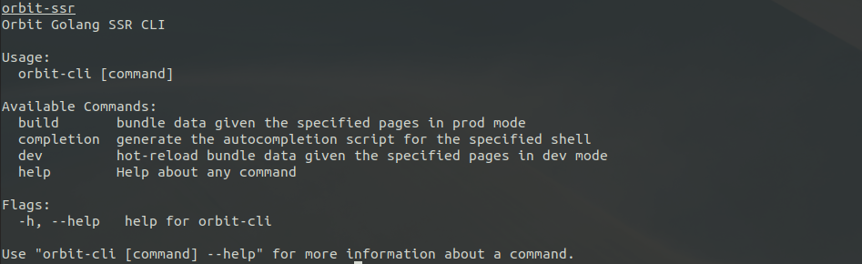

# Orbit SSR
Golang SSR framework featuring native react support with zero boilerplate.



## Installation
- manual installation

### Manual
To install manually, please download the correct distributable target for your machine. Next, you can either put it directly
in the directory you wish to use it in (and call it directly) or put it into your bash profile.


### Examples
For more examples, visit the ./examples directory.

#### Simple Example
1. Create a /pages directory in your root directory
2. Build out your react page(s) in the /pages directory.
```js
// example_page.jsx
import React from 'react'

const ExamplePage = ({name}) => {
    return (
        <>
            <h1> Example! </h1>
            <p> {name} </p>
        </>
    )
}
 
export default ExamplePage
```
3. Run `orbit build` to build your application.
4. Create a handler for your page.
```go
// ...import the generated orbit golang files here
type ExamplePageHandler struct {}

// orbit is referenced from the golang files that the orbit build command generates
func (e *ExamplePageHandler) Handle(c *orbit.RuntimeCtx) {
    propData := make(map[string]interface{})
    propData["name"] = "Bob"

    c.RenderPage(orbit.ExamplePage, propData)
}
```
5. Apply the handler to the http server in main.go
```go
// main.go
// ...import the generated orbit golang files here

func main() {
    orbit.HandlePage("/", &ExamplePageHandler{})
    orbit.Start(3000)
}
```
6. Run the application `go run main.go`


## Contributing
### Running the project
To run the project, please first download the required tools.
- nodeJS >= v11
- golang 1.14

### Building the project
After golang is installed on your machine, you can build with `go run build`

### Running tests
After golang is installed on your machine, you can run tests with `go test`